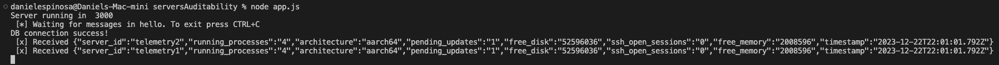
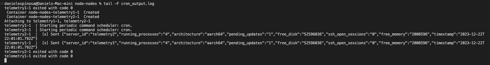
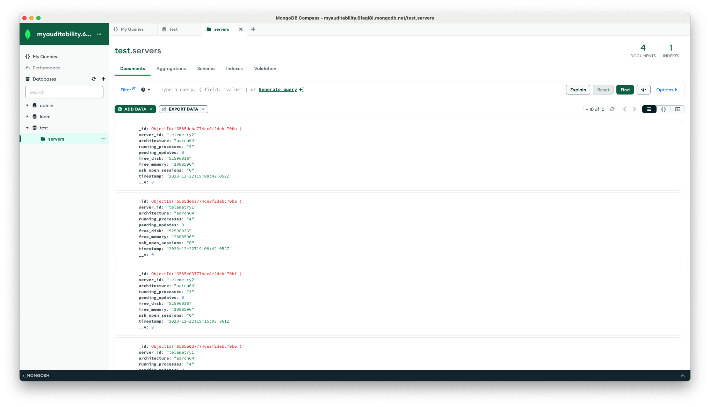

# serversAuditability


## How to install in local
Create a Mongo DB instance in [Mongo Atlas](https://account.mongodb.com/account/login)

Install [docker](https://www.docker.com/get-started/)

Install RabbitMQ using docker
```
docker run -it --rm --name rabbitmq -p 5672:5672 -p 15672:15672 rabbitmq:3.12-management
```

Clone repository
```
git clone https://github.com/Dea10/serversAuditability.git
```

```
cd ./mock/docker
docker compose up
```

Install cron
```
crontab -e
```
Modify, copy and paste `./mock/crontab` file
```
* * * * * cd /Users/<your_user>/<your_workdir> && /usr/local/bin/docker compose up >> /Users/<your_user>/<your_workdir>/cron_output.log 2>&1
* * * * * echo "success" >> /Users/<your_user>/<your_workdir>/cron.txt
```

Create .env file at project root with following variables:

Get Mongo connection from Mongo Atlas.
```
PORT=3000
MONGO_CNN=mongodb+srv://<user>:<password>@myauditability.6faqi8l.mongodb.net/
```

Start API

Track crontab logs
```
cd ./mock
tail -F cron.txt 
```
or
```
cd ./mock
tail -F cron_output.log
```

Start node
```
node app.js
```
## Endpoints
base url: http://localhost:3000/telemetry

- (POST) /addServer
    - architecture: String
    - running_processess: Number
    - server_id: String
    - timestamp: String
    - pending_updates: Number
    - free_disk: String
    - free_memory: String
    - ssh_open_sessions: String
- (GET) /full
- (GET) /audit/pending-updates
- (GET) /:serverId
- (GET) /:architecture

## Some examples

- Node API receiving messages from RabbitMQ

- Crontab running logs

- Mongo DB records
